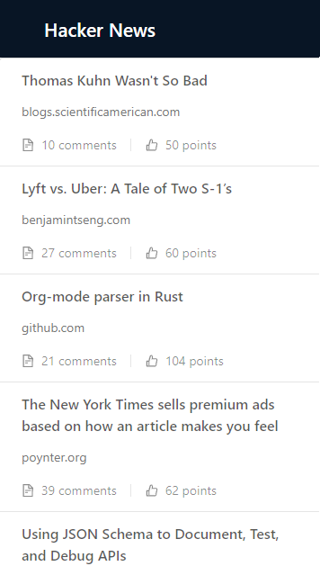

# Hacker News

A simple Hacker News reader. This project was made using React consuming [the unofficial hacker news API](https://github.com/cheeaun/node-hnapi/) provided by the community.

The main goal of this project is to use typescript to build react.js apps. This project includes:

- Created by using the new react create a new app using typescript;
- Even though this app is simple, it uses [ducks architecture](https://medium.freecodecamp.org/scaling-your-redux-app-with-ducks-6115955638be), to divide the UI from redux.
- The app's design was made using the [Ant Design](https://ant.design/) specs.
- To avoid problems defining the actions the project uses `typesafe-actions`.

As said before, the main goal of this project is to use typescript in react apps by building a simple app.

## Some imagens

- List of stories:

- Story details:

